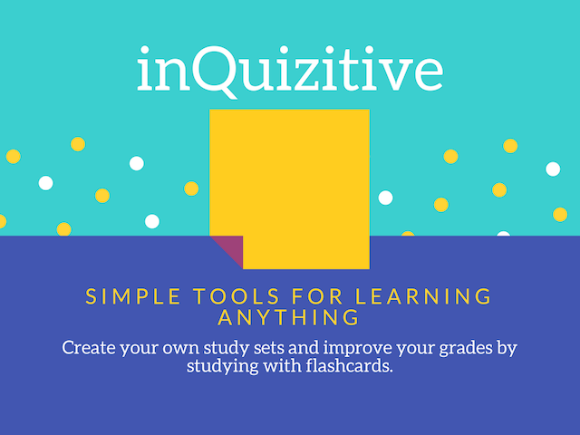
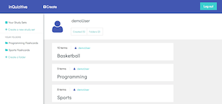
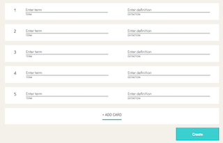
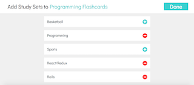
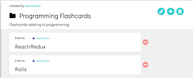

# inQuizitive

Check out the live [website][heroku] !

[heroku]: https://inquizitive-app.herokuapp.com

	

Inspired by my favorite flashcards app, inQuizitive is a full-stack web application clone of Quizlet. 

Built using:
- Ruby on Rails
- PostgreSQL
- React.js
- Redux
- jQuery

## Features and Implementation

	

When users log into the website, they are presented with a dashboard that displays all their study sets. From the dashboard, the user is able to navigate through the website. The user has the ability to view their study sets, view their folders, create a folder, and create a study set.

### Create a study set with flashcards

	

Users are able to create a study set with flashcards in one form and are able to add as many cards as they want to their study set. In order to implement this form, I had an input field for the user to enter a title for their study set and stored this information in the local state of the form. I also stored an array of card objects in the local state. Each of the card objects in the form gets their information from their corresponding card form in the page. When the user wants to add a new card, a new card object with null values is pushed into the array. When the user is ready to create the study set, the submit button will first dispatch an action to create a new study set in the database and return the new study set. Then, the form will iterate through the array of the card objects, giving the new study set's ID as a parameter to each of the card object and dispatching an action to create a new card in the database.

### Add study sets to folders

	

Users are able to organize their study sets into folders. Study sets may belong to multiple folders. When a user is viewing a study set, they have the ability to add that study set to multiple folders. When a user is viewing a folder, they have the ability to add multiple study sets to the folder. 

I wanted to allow users to add and remove multiple study sets to folders and folders to study sets without re-rendering the page each time a button was clicked. As a result, instead of having a reducer for studySetFolders, I gave each button on the form its own local state. When a button is clicked, the button component calls the appropriate AJAX request, toggles the local state, and re-renders with the opposite button. In this manner, the user many add and remove associations as many times as they want in this form without making a GET request each time a button is clicked.

	

## Future Direction

### Search study sets

Quizlet is designed for the community to have the ability to create and share flashcards, so I plan to implement a search feature that will allow users to search for study sets created by other users. Users will be able to add study sets of interest to their own folders or make a copy for themselves.

### Classes

Users will be able to join classes that will allow them to connect with other users and share flashcards with each other. They will also be able to message each other.

### Add images to flashcards

Users will be able to create flashcards with images to enhance their learning experience.